<p align="center"></p>

# Steward — local-first personal agent for macOS

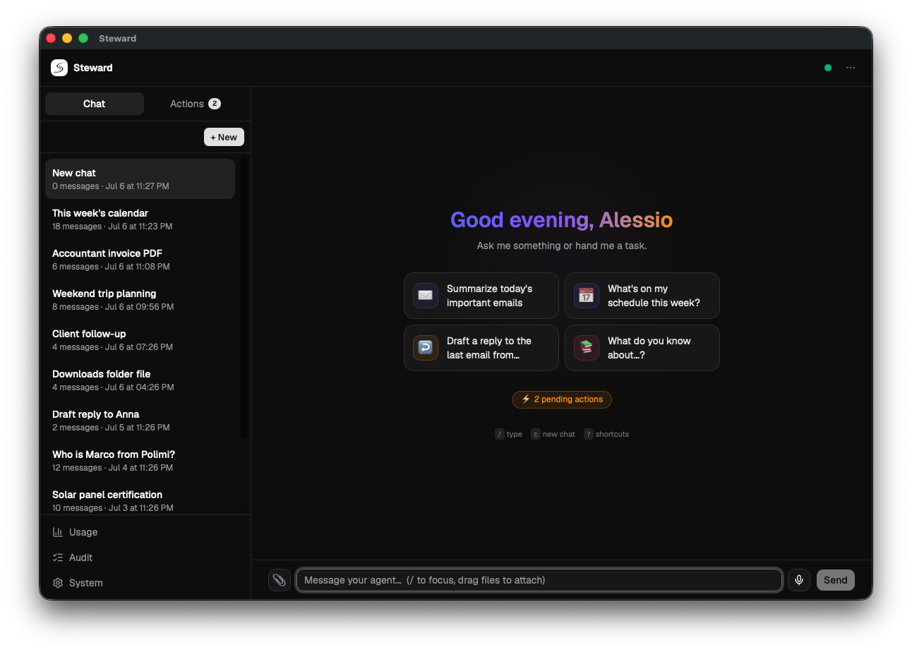

Steward is a **personal AI assistant that runs on your Mac**. It can chat with you, read your personal knowledge base, search Apple Mail, Calendar, Contacts and local files, prepare actions such as email replies or calendar events, and ask for your approval before doing anything sensitive.

The simplest way to describe it is:

> Steward is a private assistant with memory. It keeps a local wiki about your work and life, watches for useful signals in your mail and calendar, and turns them into searchable knowledge or ready-to-approve actions.

The technical way to describe it is:

> Steward is a local-first agent platform made of a React/PWA client, a Node host running a Pi-based agent, MCP connectors for local data sources, a self-hosted OpenAI-compatible LLM gateway, background indexing/distillation jobs, and a vendored LLM Wiki desktop app used as long-term inspectable memory.

Everything important runs locally. Your data is stored on your machine. Network egress is limited to the model providers configured behind the gateway, plus optional private phone access through Tailscale/Web Push.

> `apps/llm-wiki` is a vendored fork of the LLM Wiki desktop app. The surrounding Steward host, web UI, connectors, scheduler, gateway, launcher, approval system, mobile access, and automation layer are original to this repo.

## Reading Guide

- [What Steward Does](#what-steward-does) — product-level capabilities and examples.
- [Main Workflows](#main-workflows) — the user-visible chat, memory, Action Center, mobile, usage and audit experiences.
- [Architecture](#architecture) — services and the three operating planes.
- [End-To-End Data Journeys](#end-to-end-data-journeys) — complete chat, mail ingestion, threading, embedding and wiki-promotion flows.
- [Retrieval Internals](#retrieval-internals) — mail, calendar, contacts, wiki and local-file search algorithms.
- [Approval And Write Reliability](#approval-and-write-reliability) — tool policy, human approval, journaling, confirmation and retry.
- [Proactive And Background Processing](#proactive-and-background-processing) — Action Center, scheduler consistency and gateway routing.
- [Data Ownership And Rebuildability](#data-ownership-and-rebuildability) — which stores are authoritative and which are disposable indexes.
- [Failure Modes And Graceful Degradation](#failure-modes-and-graceful-degradation) — behavior when permissions, models or local services are unavailable.
- [Performance, Bounding And Backpressure](#performance-bounding-and-backpressure) — the limits that keep large local datasets and background work predictable.
- [Trust Boundaries And Threat Model](#trust-boundaries-and-threat-model) — enforced guarantees and explicit non-goals.
- [Engineering Decisions And Trade-Offs](#engineering-decisions-and-trade-offs) — why the system uses mirrors, SQLite, hybrid retrieval and deterministic policy.
- [Setup](#setup) — prerequisites, development, launcher and packaging.

## What Steward Does

### For a non-technical user

Steward gives you one place to ask questions and approve actions.

You can ask things like:

- "Find the invoice PDF the accountant sent me last month."
- "Reply to Anna and say Friday afternoon works."
- "Am I free Thursday between 14:00 and 17:00?"
- "What did we decide about the solar-panel certification?"
- "Show me the latest file in Downloads and attach it to an email."
- "Remind me what this client asked for in the last thread."

Steward can then:

- search your email, attachments, contacts, calendar, local files and wiki;
- explain what it found;
- show rich cards for emails, files, events and search results;
- prepare an email, reply, scheduled email, calendar event or file operation;
- show an approval card before a write happens;
- let you approve, edit, deny, or ask for a revised proposal;
- keep a background Action Center of things that may need your attention;
- notify your phone when there is an action waiting for you;
- keep a personal wiki of durable facts, decisions, commitments and source links.

The assistant does not silently send mail or mutate your files. It can propose those actions, but the host gates them with deterministic code and waits for your confirmation.

### For a technical user

Steward is a monorepo of local services:

- `apps/web` is the browser/PWA client.
- `apps/host` serves the web app, owns sessions, runs the agent, gates tools, stores chat history, exposes usage/system routes, and bridges UI events over WebSocket.
- `apps/llm-gateway` exposes one OpenAI-compatible endpoint with model capability tiers.
- MCP servers expose Mail, Calendar, Contacts, Shell, LLM Wiki and Action Center tools.
- `apps/scheduler` runs periodic background jobs.
- local SQLite stores mirror mail, calendar/contact indexes, action items, write-operation journals, chats and usage.
- `apps/mac-launcher` packages all of this as a menu-bar macOS app.

The agent uses MCP tools through `packages/mcp-bridge`. Tool calls are classified by a default-deny policy as allowed, gated or denied. Read-only queries can run directly; side-effecting operations become approval cards in the UI.

## Main Workflows

### Chat With Local Context

The chat UI is not a generic chatbot. It is connected to local tools:

- LLM Wiki tools for long-term memory and source-backed knowledge.
- Mail tools for search, reading threads, opening `message://` links, saving attachments, sending, replying and scheduling emails.
- Calendar tools for availability checks, search and event CRUD.
- Contacts tools for resolving people from names, emails and AddressBook records.
- Shell tools for safe file discovery and read-only command execution.
- Action Center tools for inspecting and executing pending proposed work.

Messages stream in the UI. Tool calls appear as visible cards, including status, inputs, outputs, duration and errors. The transcript can be copied as JSON for debugging.

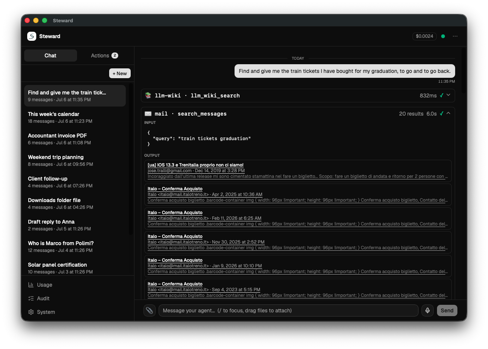

Rich results — emails, files, events — render as cards instead of raw text:

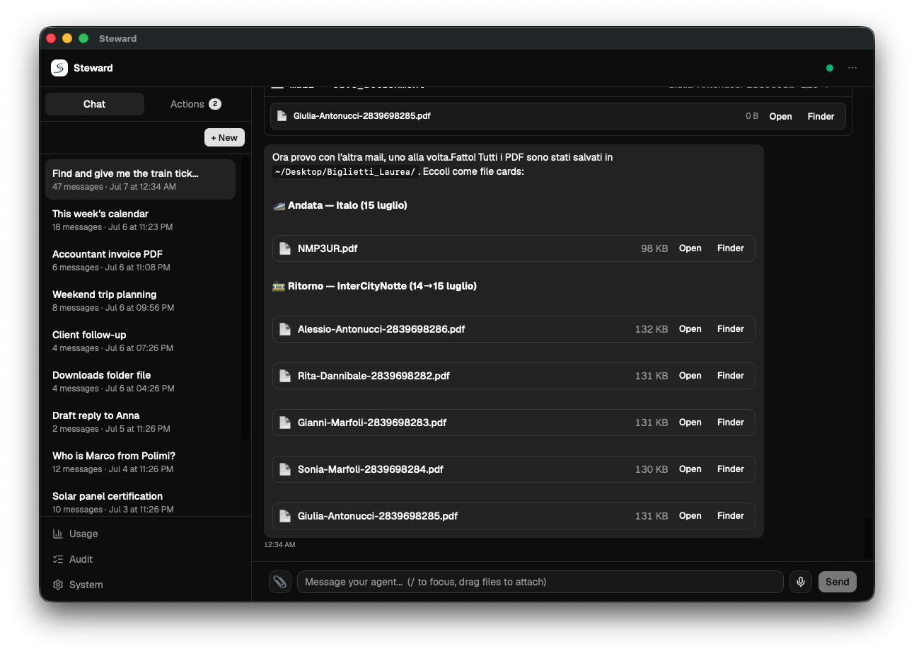

### Approval Cards

When the agent wants to perform a sensitive operation, the host turns the request into an approval card.

Examples of gated actions:

- send an email;
- reply to a thread;
- send an email later;
- create, update or delete a calendar event;
- write to the clipboard;
- run a file-mutating shell command;
- execute an Action Center proposal.

Approval cards support:

- approve;
- approve with edits;
- deny with note;
- request revision.

This means the model can suggest an action, but deterministic host code decides whether it can run.

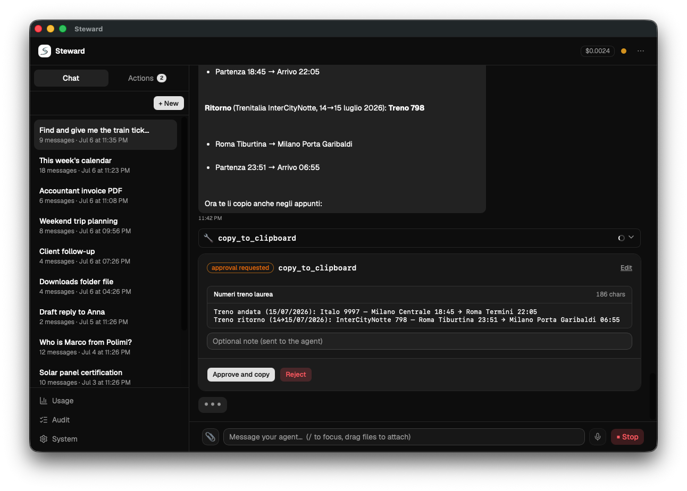

### Action Center

The Action Center is a background inbox of work Steward thinks may need you.

The scheduler scans recent mail and creates action items such as:

- reply-needed email threads;
- scheduling requests;
- follow-ups;
- proposed email responses;
- calendar proposals;
- items that should be reviewed or dismissed.

Each item stores the source thread, summary, status, proposed steps and diagnostics. The web UI shows new/read/done items. Selecting an item marks it read, opens the detail pane, and lets the agent refine or execute the proposal through the same approval flow used in chat.

The Action Center can also send Web Push notifications to a paired phone when something needs approval.

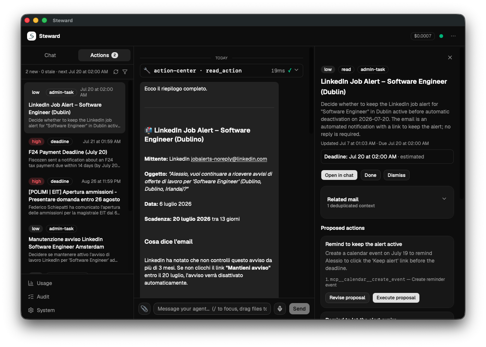

### Personal Wiki Memory

Steward uses LLM Wiki as durable memory. Instead of only retrieving raw documents at answer time, the wiki incrementally turns sources into Markdown pages that can be inspected, edited and searched.

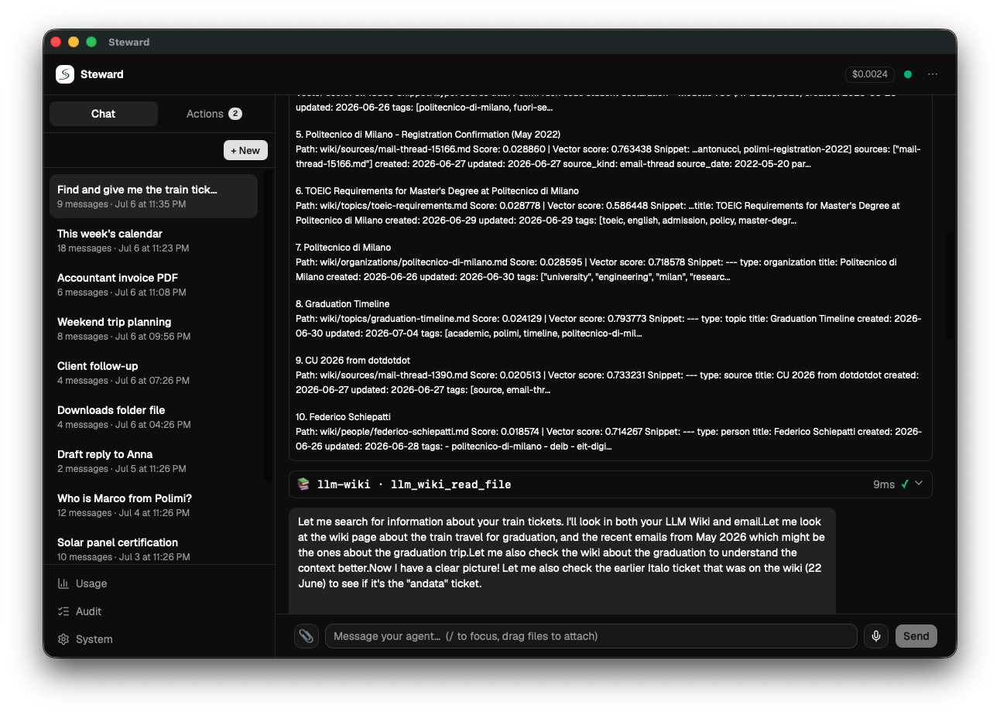

The wiki keeps:

- raw sources;
- generated wiki pages;
- `index.md` as a catalog;
- `log.md` as an operation trail;
- `purpose.md` to describe why the wiki exists;
- `schema.md` to define page rules and structure;
- YAML frontmatter with source traceability;
- Obsidian-compatible `[[wikilinks]]`;
- graph relationships between pages.

The LLM Wiki fork includes:

- desktop Tauri app;
- project templates;
- two-step ingest;
- persistent ingest queue;
- folder import;
- source folder auto-watch;
- multimodal image extraction and captioning;
- optional MinerU PDF parsing;
- vector semantic search;
- graph visualization;
- Louvain community detection;
- graph insights and Deep Research;
- lint/review flows;
- Chrome web clipper;
- local HTTP API on `127.0.0.1:19828`;
- bundled MCP server for external agents.

Steward also has `apps/wiki-add`, a small CLI and Finder Quick Actions helper for adding files or folders into the wiki.

### Mail Mirror And Mail Promotion

Steward does not ask Apple Mail to search everything live each time. It maintains a local mirror.

`apps/mail-mirror` reads Apple Mail's on-disk `.emlx` store and builds:

- SQLite message/thread tables;
- full-body records where locally available;
- soft-delete tracking;
- thread resolution;
- attachment blob storage;
- trigram keyword indexes;
- vector indexes through sqlite-vec;
- embedding state;
- mailbox role classification;
- fallback AppleScript reads for partial messages.

`apps/mail-promoter` then scans mail threads and promotes durable knowledge into the wiki. It filters noise, extracts decisions, commitments, facts, useful documents and selected attachments, then writes source notes with `message://` backlinks so you can inspect the original email.

### Calendar And Contacts

Calendar and Contacts are also indexed locally.

`apps/calendar-mcp` reads Apple's Calendar database, builds a searchable index, and can create/update/delete events through AppleScript when approved.

`apps/contacts-mcp` reads AddressBook data, deduplicates people, labels fields, supports hybrid search, and exposes `resolve_recipient` so the agent can turn "Marco" or "Anna from Polimi" into the right address before proposing an email.

### Local Files And Shell

`apps/shell-mcp` gives the agent constrained access to the filesystem.

It supports:

- finding files;
- read-only command execution;
- gated write commands.

The read-only command runner accepts familiar shell-like syntax including pipes, but it does not spawn a real shell. It parses the command itself, uses allow-listed binaries with explicit argv, and rejects dangerous constructs such as command substitution and redirection. Sensitive paths are blocked by shared path policy.

### Mobile Access

Steward can be used from a phone without exposing your Mac to the public internet.

The intended setup is:

- Tailscale connects the Mac and phone on a private network.
- The host keeps plain HTTP on localhost and can expose an HTTPS listener on all interfaces when `STEWARD_TLS_CERT` and `STEWARD_TLS_KEY` are configured, for example with a Tailscale certificate.
- The web UI is installed as a PWA.
- A shared auth token pairs the phone.
- Web Push uses VAPID keys generated by the host.
- Push notifications can open directly to a pending action.

The Mac remains the agent runtime. The phone is only a client. See [docs/mobile-access.md](docs/mobile-access.md).

The same PWA, on an iPhone, over Tailscale:

<p float="left">
  
  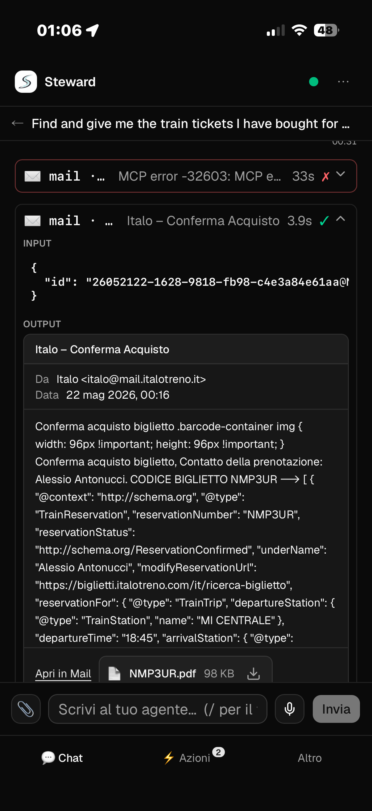
  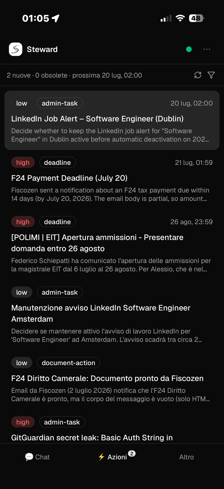
  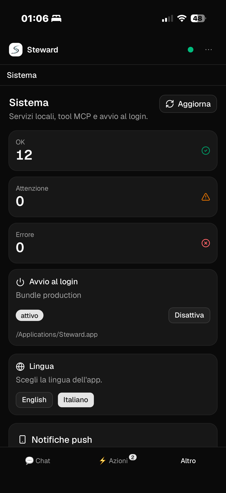
</p>

### Voice And Quick Send

The web app includes microphone recording and transcription support.

The host can transcribe uploaded audio through local `whisper.cpp` when configured with:

- `STEWARD_WHISPER_BIN`;
- `STEWARD_WHISPER_MODEL`;
- `STEWARD_SPEECH_LANGUAGE`;
- optional timeout variables.

There is also a `/quick-send` path for shortcuts such as an iPhone Action Button. It can send text or audio into a headless chat runner. Gated writes still require approval; unattended sensitive actions time out rather than silently executing.

### Usage & Cost

Every LLM call the platform makes — the host's chat agent, mail-mirror's embeddings, mail-promoter's triage/distillation, calendar-mcp's embeddings, or anywhere else — goes through the shared `apps/llm-gateway` and is logged once per call into `packages/usage-ledger`. Callers attribute their own spend with `x-usage-service` / `x-usage-action` HTTP headers; a call that forgets to label itself is recorded as `unknown` rather than silently disappearing, and the Usage page calls that out explicitly so unlabeled spend never goes unnoticed.

The web UI's **Usage** page is the observability view over that ledger: total cost and tokens for the selected period (7 days, 30 days or all-time), cost broken down by service, by action, by day, by model and by token type (input/output/cache read/cache write), plus per-tool call counts, error counts and timing (average/max/total), and a table of the most recent calls. Cost figures combine the ledger's raw token counts with the gateway's live `/rates` endpoint, so a pricing change is reflected immediately without re-ingesting old data.

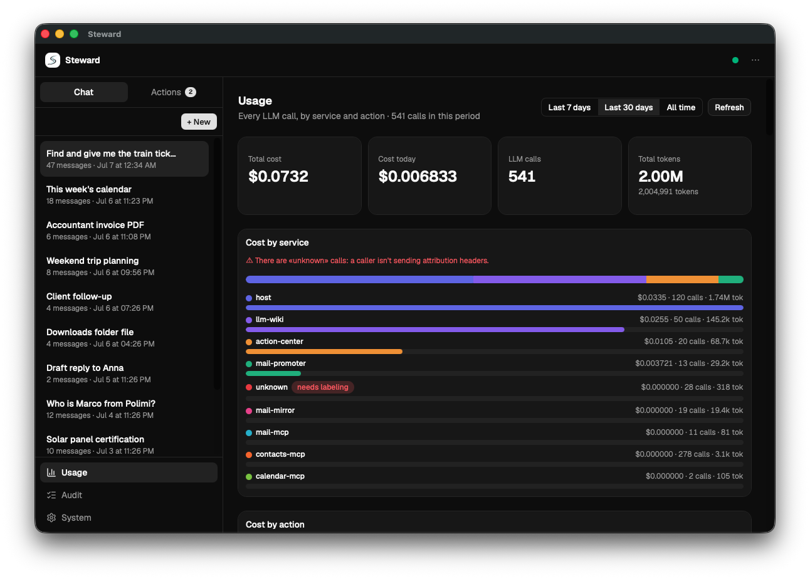

### Audit Trail

Steward keeps a redacted, queryable audit log of what happened across chat, tools, approvals and write operations.

`packages/audit-log` is a shared SQLite ledger. It records:

- user and assistant chat messages;
- tool policy decisions (allow/gate/deny) and their results;
- approval requests and responses, including timeouts;
- write-operation lifecycle (started, confirmed, retried, failed);
- Action Center item creation, execution and revision, including background items created by the scheduler;
- mail-to-wiki promotion writes;
- session, file and system events (connect, upload, open, autostart, ...).

Redaction happens before anything is written to disk. Secrets (tokens, API keys, passwords) are stripped by key name, and full email or document bodies are never stored — only a short snippet, the same convention `packages/write-ops` already uses for mail bodies. The raw, unredacted payload never touches disk.

The host exposes the ledger at `/audit` (filterable by actor, event type, risk, chat, tool, date range or free text). The web UI has an **Audit** page — reachable from the desktop sidebar footer and the mobile bottom-nav's "Altro" overflow — with a filterable timeline and a per-event detail view showing the redacted payload and any linked files/sources.

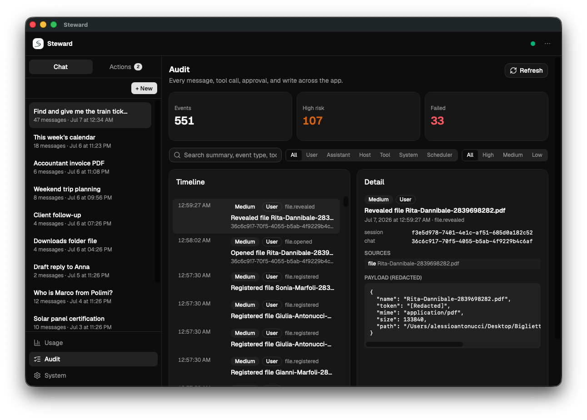

## Architecture

```text
                    browser / PWA / WebKit window
                ┌────────────────────────────────────┐
                │ apps/web                            │
                │ chat, approvals, actions, usage,    │
                │ system, mobile pairing, push, audio │
                └─────────────────▲──────────────────┘
                                  │ WebSocket + HTTP
                                  │ packages/protocol
┌────────────────────┐    ┌───────┴────────────────────────────┐
│ apps/mac-launcher  │───▶│ apps/host :4317                     │
│ menu bar app,      │    │ Pi agent sessions, auth token,      │
│ shortcut, service  │    │ tool policy, approvals, chat store, │
│ health/startup     │    │ usage ledger, file registry, push,  │
└────────────────────┘    │ speech, Action Center executor      │
                          └───────┬────────────────────▲────────┘
                                  │ MCP stdio bridge    │ OpenAI-compatible
                                  │                     │
        ┌─────────────────────────┴──────────┐  ┌──────┴──────────────────┐
        │ MCP connectors                      │  │ apps/llm-gateway :4000  │
        │ llm-wiki, mail, calendar, contacts, │  │ tier-1..tier-6,         │
        │ shell, action-center                │  │ local-embed, rates      │
        └──────────────▲──────────────────────┘  └─────────▲───────────────┘
                       │ local DB / AppleScript / files       │
        ┌──────────────┴──────────────────────────────────────┴────┐
        │ apps/scheduler                                             │
        │ mail reconcile, mail embed, mail distill, calendar sync,   │
        │ write confirmation/retry, Action Center scan               │
        └────────────────────────────────────────────────────────────┘
```

There are three operating planes:

1. **Interactive plane** — the user chats in the web UI; the host runs an agent and exposes tools through MCP. Read actions can run directly. Writes become approval cards.
2. **Background plane** — the scheduler keeps local indexes fresh, embeds mail, distills durable knowledge into the wiki, scans for action items and confirms write operations.
3. **Reliability plane** — writes are journaled before execution, confirmed against local mirrors afterwards, and retried safely if they did not actually land.

## End-To-End Data Journeys

The component diagram explains where code lives; the following walkthroughs explain how data actually moves through Steward. The system is deliberately **eventually consistent**: a new email can become lexically searchable before it has an embedding, and it can be searchable before the mail-to-wiki or Action Center pipelines have evaluated it.

### A Complete Interactive Chat Turn

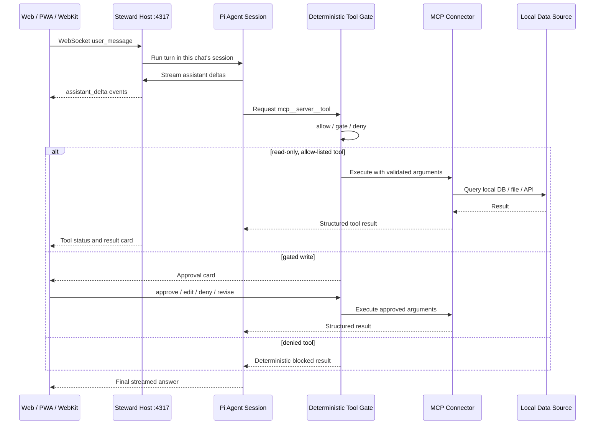
```mermaid
sequenceDiagram
    participant UI as Web / PWA / WebKit
    participant Host as Steward Host :4317
    participant Pi as Pi Agent Session
    participant Gate as Deterministic Tool Gate
    participant MCP as MCP Connector
    participant Data as Local Data Source

    UI->>Host: WebSocket user_message
    Host->>Pi: Run turn in this chat's session
    Pi->>Host: Stream assistant deltas
    Host-->>UI: assistant_delta events
    Pi->>Gate: Request mcp__server__tool
    Gate->>Gate: allow / gate / deny
    alt read-only, allow-listed tool
        Gate->>MCP: Execute with validated arguments
        MCP->>Data: Query local DB / file / API
        Data-->>MCP: Result
        MCP-->>Pi: Structured tool result
        Host-->>UI: Tool status and result card
    else gated write
        Gate-->>UI: Approval card
        UI->>Gate: approve / edit / deny / revise
        Gate->>MCP: Execute approved arguments
        MCP-->>Pi: Structured result
    else denied tool
        Gate-->>Pi: Deterministic blocked result
    end
    Pi-->>UI: Final streamed answer
```

Each chat has its own Pi session and permission-gate context, so an approval is routed back to the chat that requested it. `packages/mcp-bridge` converts MCP tools into Pi tools named `mcp__<server>__<tool>`. The host wraps every tool before it reaches the agent; the model never receives a direct handle to AppleScript, SQLite or the filesystem.

The UI receives protocol events rather than provider-specific objects. Messages, tool starts/results/errors, questions, approval requests and Action Center state therefore remain portable across the browser, installed PWA, native WebKit window and future clients.

### Incoming Email: Apple Mail To Local Mirror

A message does not arrive in the Steward client. It first lands in Apple Mail's local store. Steward then observes and reconciles that store:

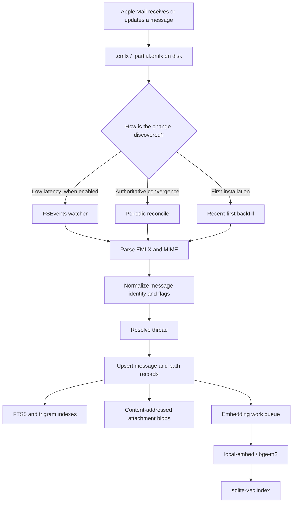
```mermaid
flowchart TD
    A[Apple Mail receives or updates a message] --> B[".emlx / .partial.emlx on disk"]
    B --> C{How is the change discovered?}
    C -->|Low latency, when enabled| D[FSEvents watcher]
    C -->|Authoritative convergence| E[Periodic reconcile]
    C -->|First installation| F[Recent-first backfill]
    D --> G[Parse EMLX and MIME]
    E --> G
    F --> G
    G --> H[Normalize message identity and flags]
    H --> I[Resolve thread]
    I --> J[Upsert message and path records]
    J --> K[FTS5 and trigram indexes]
    J --> L[Content-addressed attachment blobs]
    J --> M[Embedding work queue]
    M --> N["local-embed / bge-m3"]
    N --> O[sqlite-vec index]
```

The ingestion path in `apps/mail-mirror` performs several non-obvious tasks:

1. **Parse the actual on-disk message.** The EMLX parser separates the RFC/MIME message from Apple's plist trailer, decodes Mail flags, extracts text and attachments, and reads Apple/Gmail thread metadata where available.
2. **Choose a stable message identity.** The RFC `Message-ID` is preferred. If it is absent, Steward generates a deterministic local surrogate from the account and path.
3. **Preserve mailbox specificity.** Gmail can expose the same message in a specific label and in All Mail. An All Mail copy is not allowed to overwrite a row already attributed to a more specific mailbox.
4. **Track every physical path.** A logical message can have multiple on-disk paths. Reconciliation removes missing paths first and soft-deletes the logical message only when no path remains.
5. **Classify body availability.** A normal file is `full`; a `.partial.emlx` with some text is `partial`; a partial file without usable text is `none`.
6. **Store attachments by content.** Attachment bytes are hashed with SHA-256 and placed in a blob store, allowing duplicate content to share identity independently of filenames.
7. **Keep derived indexes rebuildable.** Message rows are the local normalized record; trigram, FTS and vector structures can be regenerated from them.

There are three synchronization modes:

| Mode | Purpose | Ordering and deletion behavior |
|---|---|---|
| `backfill` | Initial import | Enumerates the archive recent-first so current mail becomes useful before old history finishes. |
| `watch` | Low-latency updates | Uses filesystem events to ingest newly created or changed EMLX paths. Filesystem events are an optimization, not the sole source of truth. |
| `reconcile` | Guaranteed convergence | Diffs disk paths and mtimes against the database, ingests new/changed files, removes vanished paths and soft-deletes orphaned logical messages. |

The packaged scheduler runs reconciliation periodically, so missing one filesystem event does not permanently lose a message.

### How Email Threads Are Reconstructed

Apple Mail, Gmail and standard RFC headers do not always agree on conversation identity. Steward therefore resolves a surrogate `thread_id` in descending order of confidence:

1. **Existing identity** — re-ingesting a known message keeps its current thread.
2. **Gmail thread ID** — `gm_thrid` groups Gmail messages even when useful reply headers are absent.
3. **RFC reply graph** — an already-stored message referenced by `In-Reply-To` or `References` supplies the thread.
4. **Subject and participant fallback** — normalized subject plus at least one matching participant within a ±14-day window.
5. **New thread** — if no prior signal matches, Steward creates a new thread row.

The thread table tracks normalized subject, participants, first/last activity and message count. Thread identity matters beyond presentation: search collapses duplicate message hits by thread, mail promotion produces one canonical note per thread, and Action Center reasons about the conversation rather than isolated messages.

### Body Completeness And Live Fallback

Apple Mail may keep only a `.partial.emlx` until a message is opened or downloaded. Steward does not pretend a partial body is complete:

- search results expose `bodyState`;
- a useful partial body remains searchable;
- reading a partial/empty message can ask Mail.app for the live content through AppleScript;
- live content replaces the mirror text only when it is available and more complete;
- if AppleScript fails, the connector returns the best mirrored body instead of failing the entire read;
- opening a `message://` deep link remains available for inspecting the source in Mail.app.

This creates a graceful continuum: local mirror first, targeted live fallback second, explicit source link always.

### Email Embedding Lifecycle

Embedding is asynchronous and content-addressed:

1. Build source text from `subject + body`, capped by `MAIL_EMBED_MAX_CHARS` (default 2,000 characters).
2. Compute a SHA-256 source hash.
3. Skip the message if its stored embedding state already has that hash.
4. Send pending texts through the shared gateway using `local-embed`.
5. Ensure that the sqlite-vec table matches the returned vector dimension.
6. Upsert the vector and record model, dimension, hash and timestamp.

Backfill normally embeds in batches of `MAIL_EMBED_BATCH` (default 32). Failure handling is intentionally granular:

- if some members of a successful batch fail, only those members are retried individually;
- if the whole batch is rejected, every item is retried individually so one malformed input cannot block healthy messages;
- a failed item remains pending for a later cycle;
- if both the batch and all individual retries fail, the worker treats the endpoint as unavailable and backs off;
- while backlog remains, the worker shortens its delay to drain quickly; when idle or unavailable, it waits longer.

Changing the source text invalidates the hash and schedules a fresh vector. A vector-dimension change resets incompatible vector state instead of mixing embeddings from different spaces.

### Email To LLM Wiki Promotion

Being mirrored or searchable does **not** mean an email becomes long-term memory. `apps/mail-promoter` is a separate, conservative pipeline:

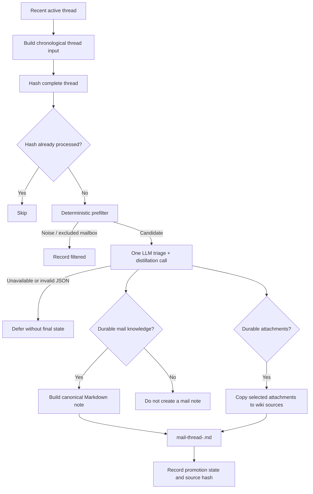
```mermaid
flowchart TD
    A[Recent active thread] --> B[Build chronological thread input]
    B --> C[Hash complete thread]
    C --> D{Hash already processed?}
    D -->|Yes| Z[Skip]
    D -->|No| E[Deterministic prefilter]
    E -->|Noise / excluded mailbox| F[Record filtered]
    E -->|Candidate| G[One LLM triage + distillation call]
    G -->|Unavailable or invalid JSON| H[Defer without final state]
    G --> I{Durable mail knowledge?}
    I -->|Yes| J[Build canonical Markdown note]
    I -->|No| K[Do not create a mail note]
    G --> L{Durable attachments?}
    L -->|Yes| M[Copy selected attachments to wiki sources]
    J --> N["mail-thread-<id>.md"]
    M --> N
    N --> O[Record promotion state and source hash]
```

Promotion is keyed by `thread:<id>`, not by message. A SHA-256 hash covers the ordered subjects and bodies of the whole thread; unchanged conversations are not sent back to the model. A new reply changes the hash and causes the canonical note to be reconsidered.

The deterministic prefilter rejects obvious noise before any LLM cost. It uses sender, subject, body state and discovered mailbox role. Candidate threads are then classified and distilled in **one** model call. That call decides:

- whether the conversation contains durable personal knowledge;
- categories such as `commitment`, `document`, `personal-fact`, `decision` and `relationship`;
- summary, facts, commitments, people and organizations;
- an optional `review_by` date for future deadlines or events;
- independently, which attachments are durable source documents and their categories.

Mail and attachment decisions are independent: a transient email can carry a durable contract, while a useful conversation can contain disposable logos and signatures. Returned categories and attachment IDs are validated against allow-lists before use.

The pipeline deliberately distinguishes final and retryable outcomes:

| Outcome | Persisted behavior |
|---|---|
| `filtered` | Deterministic prefilter rejected the thread; its hash is recorded. |
| `skipped` | The model found no new durable knowledge; its hash is recorded. |
| `promoted` | The canonical note and/or selected attachments were written and state was recorded. |
| `deferred` | Model/wiki output was unavailable or unusable; no terminal state is written, so a later run retries it. |

A promoted note uses stable YAML frontmatter with `message://` provenance, `thread://` identity, all source message IDs, account, categories, dates, selected attachments and optional review date. Updating a thread rewrites the same `mail-thread-<id>.md` rather than creating duplicate memory.

The batch runner processes most-recently-active threads first and uses a bounded worker pool (default concurrency 8). LLM/wiki calls are I/O-bound; SQLite writes remain naturally serialized by the JavaScript process and `better-sqlite3`.

## Retrieval Internals

Steward does not treat “search” as one algorithm. Exact filters, lexical relevance, substring matching and semantic similarity solve different problems, so the connectors combine them while keeping deterministic filters separate from ranking.

### Mail Search: Structured, Lexical, Substring And Semantic

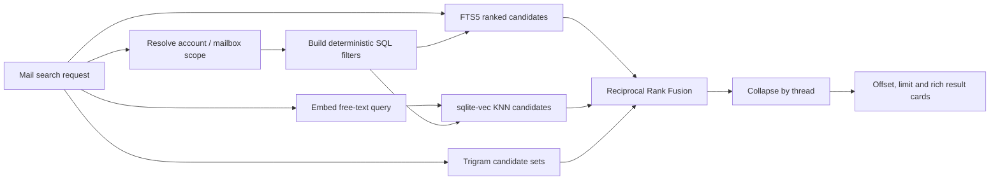
```mermaid
flowchart LR
    Q[Mail search request] --> S[Resolve account / mailbox scope]
    S --> F[Build deterministic SQL filters]
    Q --> T[Trigram candidate sets]
    Q --> X[FTS5 ranked candidates]
    Q --> E[Embed free-text query]
    E --> V[sqlite-vec KNN candidates]
    X --> R[Reciprocal Rank Fusion]
    V --> R
    F --> X
    F --> V
    T --> R
    R --> C[Collapse by thread]
    C --> P[Offset, limit and rich result cards]
```

The mail connector supports four complementary retrieval modes:

| Mechanism | What it answers well | Implementation |
|---|---|---|
| Structured SQL filters | “Unread mail from June with attachments in this account” | Dates, flags, account, mailbox, role, size and attachment constraints are composed with AND semantics. |
| FTS5 lexical ranking | “invoice renewable energy” when those words occur in the message | The free-text query is safely quoted into an FTS5 `MATCH` expression and returns up to 50 ranked candidates. |
| Trigram substring search | Partial names, address fragments, subject/body substrings | A dedicated FTS5 trigram table drives candidate selection for strings of at least three characters, avoiding full `LIKE` scans over inline message bodies. |
| Vector KNN | “the document my accountant sent about taxes” when wording differs | The query is embedded through `local-embed` and searched against `sqlite-vec`, normally using local `bge-m3` vectors. |

The actual algorithm is:

1. Resolve logical scope. Account names, explicit mailbox names, mailbox roles and “any mailbox” are normalized before SQL generation.
2. Build SQL for deterministic filters. These constraints apply independently of how results are ranked.
3. For substring arguments such as `sender`, `recipient`, `cc`, `subjectContains` and `bodyContains`, query the trigram index. Multiple substring constraints are intersected.
4. If `query` is present, retrieve at most 50 FTS5 candidates.
5. If embeddings are enabled, embed the query and verify that its vector dimension matches the stored index.
6. Retrieve at most 50 nearest vector candidates.
7. Reapply structured filters to vector hits while preserving KNN order.
8. Fuse lexical and semantic rankings with Reciprocal Rank Fusion (RRF, default constant `k=60`). RRF combines rank positions instead of attempting to compare incompatible BM25 and vector-distance score scales.
9. Intersect the ranked output with trigram candidates when substring constraints are present.
10. Unless `perMessage` is requested, keep only the highest-ranked message from each thread.
11. Materialize summaries in ranked order and apply offset/limit.

When no free-text query is supplied, search becomes deterministic browsing: the connector orders a wider pool (up to 500 messages) by date or size, then applies filters, substring candidate sets, offset and limit. This is important for requests such as “show the ten largest attachments from last month,” where semantic ranking would be meaningless.

Examples:

| User intent | Retrieval path |
|---|---|
| “Find the solar certification email” | FTS5 + vector KNN → RRF → thread collapse |
| `subjectContains: "certificat"` | Trigram candidate set |
| `sender: "marco", after: "2026-06-01"` | Trigram sender match intersected with date filter |
| “The PDF my accountant sent about property taxes” | Semantic retrieval can match without exact wording; lexical hits strengthen the RRF rank |
| “Newest unread messages in Inbox” | Structured filters and date ordering; no embedding needed |

If the embedding endpoint is disabled or unavailable, `vecIds` is empty and the same request degrades to lexical/trigram search. The local mirror therefore remains useful without any model provider.

### Reading A Mail Result

Search returns compact summaries and a stable `message://` URL. A separate read resolves the selected message:

1. Reject rows that have been soft-deleted.
2. Load subject, sender, date, mirrored body and attachment metadata from SQLite.
3. If the body is partial or empty, run a scoped AppleScript read against Mail.app.
4. Accept live text only if it is usable and more complete than the mirror.
5. Return the best body, explicit body state, attachments and deep link.

Keeping search and read separate avoids sending entire email bodies through the agent context when a ranked summary is enough.

### Calendar Search

Calendar reads start from Apple's Calendar CoreData store under `~/Library/Group Containers/group.com.apple.calendar/`. The indexer normalizes events into Steward's SQLite index and optionally adds `local-embed` vectors.

`search_events` accepts independent dimensions:

- a free-text `query`;
- start/end time range;
- account;
- calendar;
- result limit.

All supplied constraints are ANDed. With an index and a free-text query, lexical and semantic rankings are combined. A pure time-range query does not pay for an embedding. If the sidecar search index is unavailable, the connector can fall back to direct event-range reading, preserving basic availability and chronological lookup.

This separation supports distinct questions efficiently:

| Question | Important signals |
|---|---|
| “Am I free Thursday afternoon?” | Time overlap and calendar filters; semantic search is unnecessary. |
| “Meetings about the certification project” | Hybrid text/vector relevance constrained to an event window. |
| “What was my appointment with Marco in May?” | Name/title relevance plus historical time range. |

Calendar writes do not modify the CoreData database directly. Approved create/update/delete operations go through Calendar.app via AppleScript, and later synchronization observes the authoritative result.

### Contacts Search And Recipient Resolution

The contacts connector reads the top-level and per-source AddressBook stores, normalizes labeled emails/phones and builds a local hybrid-search index.

Contacts can appear in multiple iCloud, Exchange or local sources. Indexing uses an email-first deduplication heuristic: records sharing a primary email are merged under a sidecar `uid`, and the result retains the source UUIDs that contributed data.

`search_contacts` answers general discovery queries. `resolve_recipient` is stricter: it returns a ranked list of email-bearing candidates for descriptions such as “Anna from Polimi” or “my accountant,” but **does not auto-pick one**. Ambiguous identity remains an agent/user decision before a mail tool is proposed.

The index `uid` is distinct from Contacts.app's `personId`. Reads use the sidecar UID; AppleScript updates require the native person ID. Documenting both prevents a subtle but dangerous identifier mix-up.

### LLM Wiki Search

The wiki is a different retrieval layer from raw-source search:

- mail/calendar/contact indexes answer questions from normalized source records;
- LLM Wiki answers questions from durable, distilled Markdown knowledge;
- wiki pages preserve provenance and can link related people, projects and decisions;
- vector search finds semantically related pages;
- wikilinks and the graph expose explicit relationships;
- Deep Research and graph insights operate over the curated knowledge layer rather than every raw message.

The agent can use both layers in one turn. A question about an established project decision may be answered from the wiki; a request for the exact latest email should query the mail mirror and open the source.

### Local File Search And Safe Command Execution

`apps/shell-mcp` separates file discovery from command execution. Its read-only runner accepts familiar shell-like pipelines but does not invoke a general shell:

- input is parsed into commands and explicit argument arrays;
- only allow-listed binaries are available;
- command substitution, arbitrary redirection and other dangerous shell constructs are rejected;
- shared sensitive-path rules block secrets and protected locations;
- file-mutating commands use a separate gated tool.

This retains useful operations such as sorting or inspecting local files without giving model-generated text the authority of `sh -c`.

## Approval And Write Reliability

Model intent, user authority and operating-system effects are separate stages.

### Deterministic Tool Policy

Every Pi tool definition is wrapped by the host before being exposed to the agent. `decideTool` returns exactly one of:

- `allow` — execute immediately; reserved for known read-only tools;
- `gate` — emit an approval request and wait;
- `deny` — return a blocked result without asking.

The default is `gate`. Known mail/calendar/contact/wiki reads and safe file operations are explicitly allow-listed. Write tools fall through to the gated default. Deny prefixes can disable whole namespaces. This policy is ordinary TypeScript code, not a sentence in the system prompt, so prompt injection cannot redefine it.

### Approval Lifecycle

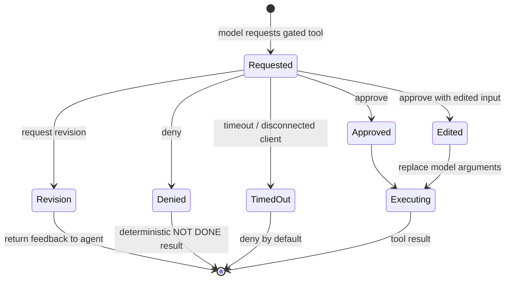
```mermaid
stateDiagram-v2
    [*] --> Requested: model requests gated tool
    Requested --> Approved: approve
    Requested --> Edited: approve with edited input
    Requested --> Denied: deny
    Requested --> Revision: request revision
    Requested --> TimedOut: timeout / disconnected client
    Approved --> Executing
    Edited --> Executing: replace model arguments
    Revision --> [*]: return feedback to agent
    Denied --> [*]: deterministic NOT DONE result
    TimedOut --> [*]: deny by default
    Executing --> [*]: tool result
```

The approval card carries the proposed tool and arguments. The user can approve them unchanged, replace individual arguments, deny with a note or ask the agent to revise the proposal. Approve-with-edit is enforced in the gate: the connector receives the edited input, not the model's original input.

Pending approvals live in the chat's `Session` and expire after `APPROVAL_TIMEOUT_MS`. A timeout resolves to denial. The headless `/quick-send` runner has no attached client; if it reaches a gated write, the approval request has nowhere to go and safely times out rather than executing unattended.

### Journal, Confirmation And Retry

Approval answers “may this be attempted?” It does not prove that Mail.app or Calendar.app actually committed the operation. Side-effecting connectors therefore use `packages/write-ops`:

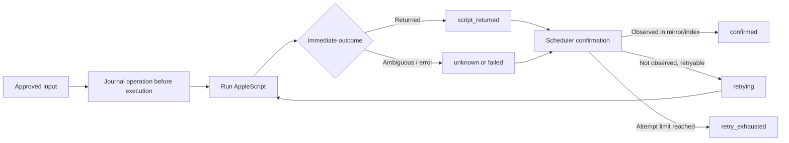
```mermaid
flowchart LR
    A[Approved input] --> B[Journal operation before execution]
    B --> C[Run AppleScript]
    C --> D{Immediate outcome}
    D -->|Returned| E[script_returned]
    D -->|Ambiguous / error| F[unknown or failed]
    E --> G[Scheduler confirmation]
    F --> G
    G -->|Observed in mirror/index| H[confirmed]
    G -->|Not observed, retryable| I[retrying]
    I --> C
    G -->|Attempt limit reached| J[retry_exhausted]
```

The journal stores operation kind, sanitized input, expected observable outcome, attempts, confirmation attempts, timestamps and terminal result/error. Mail confirmation reads the mail mirror; calendar confirmation reads the synchronized calendar view. This makes retries evidence-based and reduces the risk of treating an AppleScript return value as proof.

Scheduled mail adds another state: the operation is recorded with `scheduled_for` and is not sent until `write-ops-send-due` claims it. The scheduler then executes and confirms it through the same lifecycle.

The write journal is also an operational source for the audit trail, but the two stores have different roles: `write-ops` drives correctness and retry state; `audit-log` provides a redacted human-readable history.

## Proactive And Background Processing

### Action Center Lifecycle

Action Center and mail-to-wiki promotion consume some of the same mail mirror, but answer different questions:

- **mail-promoter:** “Is there durable knowledge worth remembering?”
- **Action Center:** “Is there unresolved work that may need the user's attention now?”

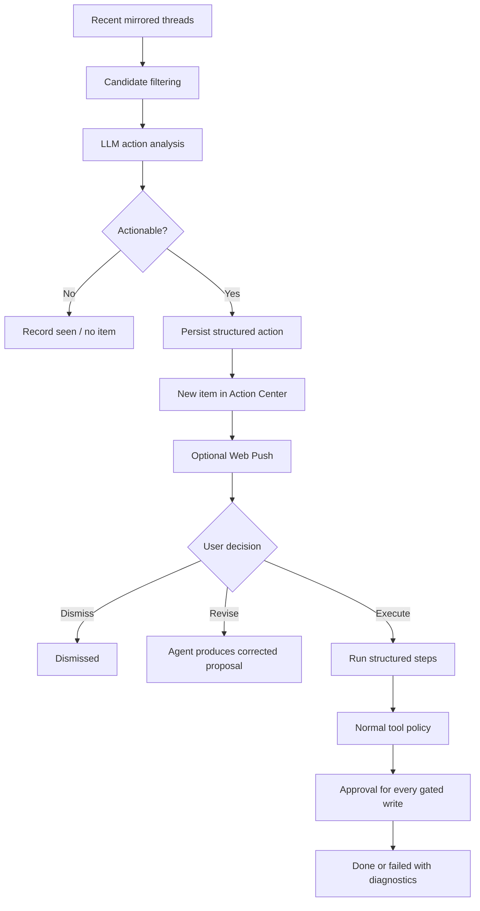
```mermaid
flowchart TD
    A[Recent mirrored threads] --> B[Candidate filtering]
    B --> C[LLM action analysis]
    C --> D{Actionable?}
    D -->|No| E[Record seen / no item]
    D -->|Yes| F[Persist structured action]
    F --> G[New item in Action Center]
    G --> H[Optional Web Push]
    H --> I{User decision}
    I -->|Dismiss| J[Dismissed]
    I -->|Revise| K[Agent produces corrected proposal]
    I -->|Execute| L[Run structured steps]
    L --> M[Normal tool policy]
    M --> N[Approval for every gated write]
    N --> O[Done or failed with diagnostics]
```

An action item stores source identity, title, summary, status, proposed steps and diagnostics. A proposed action can contain:

- a **tool step**, with a concrete MCP tool and arguments ready for policy evaluation;
- a **manual step**, for work Steward cannot automate safely, with explanatory links instead of invented tool calls;
- a confidence level and summary explaining the proposed alternative.

The item separately retains a context snapshot with the triggering mail, relevant calendar/contact/wiki context, read-tool observations and planning rationale. That snapshot lets chat refinement continue without silently reinterpreting the original trigger.

Generating a plan does not authorize it. Executing an Action Center step reuses the host's deterministic tool policy and approval UI. A prepared email reply still becomes a gated mail write.

Items move through `new`, `read`, `done` and `dismissed`; opening an item marks it read, while completion/dismissal is explicit. A handled item stays closed unless genuinely newer activity appears on the same source thread.

Cross-thread resolution handles a common real-world edge case: a later message can answer an open task while landing in a different Mail thread. Candidate actions are conservatively limited by correspondent domain and recency. If the new message actually answers or meaningfully updates the task, Steward updates the action's summary but **does not auto-close it**; the user reviews and confirms the resolution.

The scanner also has deliberate backlog and thread semantics:

1. On first activation, it normally marks the existing recent window as seen instead of generating dozens of stale actions. Set `ACTION_CENTER_NO_SEED=1` when an initial backlog review is explicitly desired.
2. Later scans consider genuinely new message IDs, regardless of read/answered state. A new reply in an old thread is new input.
3. Junk, empty bodies, no-reply senders and low-value surveys are removed deterministically.
4. Fresh messages are grouped by the mirror's canonical `thread_id`.
5. The planner receives a chronological rendering of the whole thread, not just the latest sentence.
6. A representative external/request-like message anchors sender and source identity while the latest trigger controls recency.
7. Action analysis determines kind, priority, deadline, scheduling slots and draft responses.
8. Read-only context gathering can consult related mail, contacts, calendar and wiki before the second planning step produces executable alternatives.
9. Read observations become part of the context snapshot; the final proposal does not include redundant read steps.
10. Successfully considered message IDs are recorded incrementally, so a crash midway through a scan preserves completed progress.

Handled actions are sticky. Repeated scans do not resurrect a `done` or `dismissed` item unless a genuinely newer message arrives on that same source thread.

### Scheduler Semantics

`apps/scheduler` is intentionally thin. It launches existing application CLIs instead of duplicating their business logic. Each job has:

- a configurable interval;
- a per-run timeout;
- no overlap with another instance of the same job;
- isolated error handling, so one failed pipeline does not stop unrelated work;
- structured JSONL logging in the packaged flow.

Jobs run once when the scheduler starts and then at their configured interval. The no-overlap guard is per job: a slow mail-distill run can cause its next tick to be skipped without preventing calendar sync or write confirmation.

The resulting consistency timeline for a newly arrived email can look like:

```text
T+0       Apple Mail writes .emlx
T+seconds watcher ingests it, if the watcher is enabled
T+0–10m   reconcile guarantees mirror convergence
T+0–15m   embedding job adds semantic retrieval
T+0–15m   mail-distill evaluates durable memory
T+0–10m   Action Center evaluates unresolved work
```

These pipelines are independent. An email may be:

- mirrored and lexically searchable but not embedded yet;
- embedded but not evaluated for the wiki yet;
- promoted to long-term memory without generating an action;
- actionable without being durable enough for the wiki.

No ordering assumption between independent jobs is required for correctness. Source hashes, seen ledgers and idempotent upserts make repeated runs safe.

### LLM Gateway Request Lifecycle

Every model call crosses `apps/llm-gateway`, even when the underlying model is local:

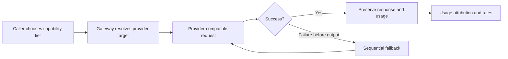
```mermaid
flowchart LR
    A[Caller chooses capability tier] --> B[Gateway resolves provider target]
    B --> C[Provider-compatible request]
    C --> D{Success?}
    D -->|Yes| E[Preserve response and usage]
    D -->|Failure before output| F[Sequential fallback]
    F --> C
    E --> G[Usage attribution and rates]
```

Callers choose capability, not vendor:

- the host can request `tier-5` without knowing which DeepSeek model implements it;
- background classification can choose a cheaper tier;
- embeddings always use `local-embed`;
- provider keys, base URLs and fallback behavior stay inside one service.

For non-streaming calls, a failed target can escalate and then sweep compatible lower paid rungs. Streaming is more constrained: the gateway can retry only before response bytes reach the client. It may fall back from a failed native stream to a non-streaming response re-emitted as synthetic SSE, but it never switches providers in the middle of visible output.

The gateway preserves provider usage fields and exposes current rates. Callers add `x-usage-service` and `x-usage-action` so cost can be attributed to, for example, `mail-promoter / triage` instead of only “tier-5.” Missing attribution is recorded as `unknown` and surfaced in the Usage page; it is never silently dropped.

## Data Ownership And Rebuildability

Not every SQLite database has the same authority. Some are disposable indexes over Apple-owned data; others are Steward's primary operational history.

| Data | Source of truth | Steward representation | Rebuildable? |
|---|---|---|---|
| Mail messages | Apple Mail EMLX store | `mail-mirror/mail.db` | Yes, via backfill/reconcile; promotion and embedding state can be regenerated. |
| Mail attachments | EMLX/Mail.app | Content-addressed mirror blobs | Yes when the original remains available. |
| Calendar events | Apple Calendar CoreData store | `calendar-index.sqlitedb` | Yes, via calendar sync. |
| Contacts | AddressBook stores | `contacts-index.sqlitedb` | Yes, via contacts index. |
| Long-term memory | Wiki Markdown sources/pages | Wiki vector and graph indexes | Markdown is primary; indexes are rebuildable. |
| Action items | Steward analysis and user state | `action-center/actions.db` | No; status and review history are primary Steward state. |
| Write operations | Attempt/confirmation lifecycle | `write-ops/ops.db` | No; required for safe confirmation and retry. |
| Chats | User/assistant/tool transcript | `steward-chats/chats.db` and session files | No; this is primary conversation state. |
| Usage | Gateway and tool-call accounting | `steward-usage/usage.db` | Not fully; provider history may not be available later. |
| Audit | Redacted event stream | `steward-audit/audit.db` | No; the redacted record is intentionally primary. |

This distinction guides recovery. Deleting a search index costs time; deleting the write journal can remove the evidence needed to decide whether a side effect should be retried.

## Failure Modes And Graceful Degradation

Steward is designed to retain narrower functionality when a dependent service is missing:

| Failure | Behavior |
|---|---|
| LLM gateway offline | Existing lexical/trigram mail search and deterministic filters still work. New embeddings, agent turns, promotion and Action Center LLM analysis wait or fail explicitly. |
| Embedding endpoint disabled | Mail, calendar and contact indexes operate in keyword-only mode. No vector results are mixed into ranking. |
| One embedding input poisons a batch | Failed members are retried individually; healthy members still advance. |
| Vector dimension changes | Incompatible vector state is reset rather than queried with mixed dimensions. |
| `.partial.emlx` body | The available text is indexed and a read attempts a scoped AppleScript fallback. |
| Mail watcher misses an event | Periodic reconcile discovers the path/mtime difference. |
| Message disappears from one Gmail mailbox | Its path is removed; the logical message survives while another path remains. |
| Full Disk Access missing | Local Apple database reads return actionable permission errors rather than silently empty results. |
| Automation permission denied | Reads remain available; AppleScript writes fail without bypassing policy. |
| Mail-promoter triage returns invalid JSON | The thread is deferred without terminal promotion state, so it can be retried; no malformed wiki note is committed. |
| Action Center planning fails | The scan records deferred diagnostics. Thrown planner failures remain unseen for retry; ordinary no-action outcomes are recorded in the seen ledger. |
| Wiki API unavailable | Promotion is deferred while the mail mirror remains usable. |
| No UI is attached to a gated request | Approval times out to deny. Quick Send cannot silently execute writes. |
| AppleScript returns but the change is not observed | The write remains unconfirmed and enters bounded confirmation/retry handling. |
| Push subscription is expired | The dead subscription is pruned; the Action Center item remains available in the UI. |
| Gateway rates unavailable | Usage display falls back to configured static rates; raw tokens remain recorded. |

This degradation model is deliberate: a missing probabilistic or remote capability should not make deterministic local data inaccessible.

## Performance, Bounding And Backpressure

Local-first does not mean unbounded. Several limits keep cold starts, model context and background work predictable:

| Area | Bound or strategy | Reason |
|---|---|---|
| Mail SQLite | WAL mode, best-effort 2 GiB mmap and 64 MiB page cache | Multiple readers can search while ingestion writes; large local archives avoid repeated cold-page reads. |
| Ranked mail search | 50 lexical + 50 vector candidates | Ranking stays fast before RRF and final filtering. |
| Trigram search | Up to 500 candidates per field | Substring filters drive selection without scanning all inline bodies. |
| Unranked mail browse | 500-row window; final API limit max 100 | Supports sorting/pagination without materializing the entire archive. |
| Mail embedding input | First 2,000 characters by default | Bounds embedding cost and latency while retaining subject and leading body context. |
| Embedding batches | 32 by default, with per-item recovery | Amortizes gateway overhead without allowing one input to poison the queue. |
| Mail promotion | Thread hashes plus worker pool, concurrency 8 by default | Avoids unchanged work and overlaps I/O-bound model/wiki requests. |
| Action Center | Recent window 14 days, query pool 300, process limit 50 by default | Focuses background attention on new actionable mail and bounds model calls. |
| Triage bodies | Cleaned/truncated single messages; larger chronological thread representation | Prevents quoted-history explosions while preserving multi-message decisions. |
| Scheduler | Per-job timeout and no-overlap set | Applies backpressure when a prior run is still active. |

These values are implementation defaults, not architectural constants. Environment variables expose the operationally important ones, while hard candidate caps protect interactive latency. Performance changes should be measured against realistic multi-gigabyte mail databases, not only test fixtures.

### Measured Local Benchmarks

The following measurements were taken on 2026-08-19 on the primary development system:

- Apple M4, 16 GiB RAM, arm64;
- macOS 26.3.1;
- packaged Steward services and Ollama already running;
- SQLite databases opened with `readonly` and `query_only=ON`;
- fixed generic queries only; no message, event or contact content was printed;
- eight repetitions for SQLite operations (first sample plus seven warm samples), six for embedding/hybrid operations.

The gateway embedding calls were labeled `benchmark / readonly-embedding`. They performed no external write operation, though the gateway correctly added their token/timing records to Steward's normal usage ledger.

#### Dataset

| Index | On-disk size | Active records | Vector coverage |
|---|---:|---:|---:|
| Mail mirror | 3.7 GiB | 69,155 messages, 38,294 threads, 11,235 attachments | 69,371 embedding-state rows, 1,024 dimensions |
| Calendar | 9.2 MiB | 553 events | 553/553, 1,024 dimensions |
| Contacts | 4.4 MiB | 771 normalized contacts | 771/771, 1,024 dimensions |

The mail mirror contained 32,500 active `partial`/`none` bodies (47.0%), demonstrating why explicit body state and targeted AppleScript fallback matter in practice. Mail embedding-state count is reported independently from the active-message count because state can temporarily include rows outside the current active set until maintenance catches up.

#### Query Latency

| Operation | Result pool | First sample | Warm median | Warm p95 |
|---|---:|---:|---:|---:|
| Mail FTS5, top 50 | 37 | 16.16 ms | **0.71 ms** | 0.85 ms |
| Mail trigram subject, top 500 | 72 | 40.06 ms | **2.06 ms** | 2.22 ms |
| Mail trigram body, top 500 | 252 | 43.66 ms | **2.25 ms** | 2.61 ms |
| Mail structured recent/unread, top 20 | 20 | 40.81 ms | **13.49 ms** | 14.11 ms |
| Mail vector KNN, top 50 | 50 | **4,133.66 ms** | **34.67 ms** | 53.15 ms |
| Gateway `local-embed`, 1,024 dimensions | 1 vector | 162.26 ms | **119.50 ms** | 123.55 ms |
| Mail hybrid end-to-end after index warm-up | 50 | 183.29 ms | **175.35 ms** | 179.22 ms |
| Calendar FTS5, top 500 | 57 | 8.12 ms | **0.08 ms** | 0.12 ms |
| Calendar vector KNN, top 500 | 500 | 141.70 ms | **1.12 ms** | 1.27 ms |
| Contacts FTS5, top 200 | 3 | 1.69 ms | **0.02 ms** | 0.02 ms |
| Contacts vector KNN, top 200 | 200 | 63.97 ms | **0.37 ms** | 0.41 ms |

The hybrid measurement includes local query embedding, FTS retrieval, vector KNN and in-process RRF. It was run after the standalone vector test had mapped the vector table, so it represents steady interactive behavior rather than process startup.

A separate warm-cache negative lookup over the full mail corpus compared a synthetic absent substring:

| Strategy | Wall time |
|---|---:|
| Trigram `MATCH` | <10 ms |
| `body_text LIKE '%…%'` full scan | 290 ms |

The result validates the architecture's main performance assumptions:

1. **Lexical and substring retrieval are not bottlenecks** once the SQLite pages are warm.
2. **Embedding generation dominates steady-state hybrid latency**: approximately 120 ms of a 175 ms query.
3. **Mail vector startup is expensive**: the first KNN in a new process spent about 4.1 seconds loading/mapping the 69k × 1,024-dimensional vector index, while subsequent KNN calls were about 35 ms.
4. **Persistent MCP processes are important**: keeping the mail connector alive amortizes vector initialization instead of paying it per query.
5. **Small calendar/contact indexes are effectively instantaneous** after warm-up.
6. **The trigram index has measurable value even at 69k messages**, and the advantage grows when a `LIKE` scan cannot terminate early or filesystem pages are cold.

These are point-in-time engineering measurements, not universal product guarantees. Latency changes with query selectivity, filesystem cache, model state, archive size and concurrent background jobs. Future performance work should preserve the same methodology and record both first-process and warm distributions.

## Trust Boundaries And Threat Model

Steward assumes model output, email content, document content and tool arguments can all be wrong or adversarial. It does not assume that a strong prompt is a security boundary.

### Authority Boundaries

| Boundary | Enforcement |
|---|---|
| Model → tools | Host-side allow/gate/deny policy wraps every tool definition. |
| Read → write | Read-only tools are explicitly allow-listed; side effects are gated by default. |
| Proposed → authorized arguments | Approve-with-edit can replace model-generated input before execution. |
| Attempted → confirmed side effect | Write journal plus mirror/index confirmation. |
| Filesystem discovery → mutation | Separate read/write tools and sensitive-path guards. |
| Host → model provider | Local gateway isolates provider credentials and routing. |
| Browser → local data | Auth token on WebSocket/data routes; tokenized file registry instead of arbitrary paths. |
| Raw event → persisted audit | Secret/body redaction occurs before the payload is written to disk. |

An email can contain text that tries to instruct the agent to send data or run a command. That content may influence the model's reasoning, but it cannot change `tool-policy.ts`, approve its own write or turn a denied tool into an allowed one. The user still needs to assess the proposed action and recipient.

The model can also produce a factually wrong answer without calling a dangerous tool. Steward mitigates this with visible tool calls, source links and inspectable memory; it does not claim to make model reasoning infallible.

### What The Security Model Does Not Promise

- A user-approved harmful action is still authorized.
- Full Disk Access gives the Steward process broad read capability; OS account security remains important.
- A configured remote model provider receives the prompt/context sent through the gateway.
- Tailscale/private HTTPS reduces exposure but does not replace token hygiene.
- Local SQLite and Markdown stores are not encrypted by Steward; disk encryption and macOS account protection remain the storage boundary.
- Audit redaction minimizes persisted sensitive content but is not a substitute for reviewing what external providers receive.

## Engineering Decisions And Trade-Offs

### Why Mirror Apple Mail Instead Of Searching Through AppleScript?

AppleScript is useful for targeted live reads and authorized writes, but it is slow and awkward for large ranked searches. A local mirror provides predictable SQL queries, offline search, thread reconstruction, trigram indexing and embeddings. Reconciliation absorbs the complexity of keeping that mirror current.

### Why SQLite?

The data is single-user, local and moderate in scale. SQLite keeps deployment self-contained, supports transactions and FTS5, and works with sqlite-vec in the same process. Separate databases also give each service ownership of its schema and failure domain without requiring a database daemon.

### Why FTS, Trigrams And Vectors?

No one retrieval method dominates:

- FTS is precise and cheap for words that appear in the source.
- Trigrams make substring filters fast and predictable.
- vectors recover semantically related text with different vocabulary.
- deterministic SQL handles dates, flags, mailboxes and identities.

RRF combines rankings without pretending their raw scores are comparable.

### Why Distill Whole Threads?

Decisions and commitments often emerge across replies. Per-message notes duplicate context and can preserve obsolete intermediate states. One canonical thread note captures the current conversation while retaining all source message IDs.

### Why Markdown Memory?

Markdown makes memory inspectable, editable, portable and versionable. YAML frontmatter preserves machine-readable provenance; wikilinks and graphs add structure without hiding knowledge in a proprietary database.

### Why One Triage And Distillation Call?

The original economic reason for a cheap classifier followed by an expensive distiller disappears when one capable low-cost model can do both. A single structured call reduces latency, token duplication and failure points. Deterministic prefilters still remove obvious noise before the model.

### Why Capability Tiers?

Callers express required capability while the gateway owns provider choice. This allows model migrations, local/paid routing, fallback and cost accounting without changing every application.

### Why Confirm Writes Against Mirrors?

AppleScript completion is not the same as externally observable success. Confirmation turns “the script returned” into “the expected mail/event exists,” which is the invariant users care about.

### Why Is Policy Outside The Prompt?

Prompts are probabilistic instructions to a model. Authorization must be deterministic application code that the model cannot rewrite, ignore or reinterpret.

### Why Keep Wiki Promotion And Action Center Separate?

Durability and urgency are orthogonal. A passport or long-term decision belongs in memory but may need no action; a routine scheduling request may need action but is not durable knowledge. Separate pipelines let each use its own state, thresholds and lifecycle.

## Extending Steward Safely

Adding a connector is more than registering an MCP server. A complete integration should:

1. Define typed read and write tools with narrow schemas.
2. Keep source-system reads separate from side effects.
3. Add read tools explicitly to `tool-policy.ts`; leave writes gated or explicitly deny them.
4. Validate identifiers, paths, recipients and date ranges inside the connector.
5. Return stable structured results suitable for UI cards and agent follow-up.
6. Attribute gateway calls with service/action headers.
7. Emit redacted audit events for meaningful operations.
8. Journal and confirm non-idempotent writes when the source system permits observation.
9. Expose health/status diagnostics.
10. Add unit tests for parsers, filtering, policy behavior, error mapping and edge cases.
11. Add a live test separately and keep it out of CI if it touches personal data.
12. Document permissions, source of truth, rebuildability and graceful-degradation behavior.

For a new client/channel, implement `packages/protocol` rather than reaching into Pi or MCP directly. The host should remain the single authority for sessions, tool policy, approvals and data-route authentication.

## Components

| Path | Purpose |
|---|---|
| [apps/web](apps/web/) | React + Vite + PWA UI. Provides chat, chat list, mobile layout, Action Center, approval/question cards, tool cards, rich cards, file uploads/chips, audio recording, Usage page, Audit page, System page, phone pairing, notification controls and service worker. |
| [apps/host](apps/host/) | Node host on `:4317`. Serves the built UI, owns WebSocket sessions, runs Pi agent sessions, loads MCP tools, applies the tool policy, stores chats, records usage, handles approvals/questions, serves tokenized files, registers uploaded/local files, manages auth/pairing, push, speech transcription, system status and the audit ledger. |
| [packages/protocol](packages/protocol/) | Dependency-free event contract between host and clients. Keeps chat, approvals, questions, tool calls, files and Action Center state portable across future clients. |
| [packages/mcp-bridge](packages/mcp-bridge/) | Converts stdio MCP servers into Pi custom tools named like `mcp__server__tool`. |
| [apps/llm-gateway](apps/llm-gateway/) | Local OpenAI-compatible gateway on `:4000`. Provides `tier-1` through `tier-6`, `local-embed`, `/rates`, `/health`, `/v1/models`, chat completions and embeddings. Routes to Ollama and DeepSeek by default. |
| [apps/llm-wiki](apps/llm-wiki/) | Vendored LLM Wiki desktop app and MCP server. Provides persistent Markdown memory, ingest, search, graph, lint, review, Deep Research and local API. |
| [apps/mail-mirror](apps/mail-mirror/) | Local SQLite mirror of Apple Mail. Handles backfill, watch, reconcile, embeddings, thread resolution, mailbox roles, partial-message fallback and attachment blobs. |
| [apps/mail-mcp](apps/mail-mcp/) | Mail MCP connector. Searches, reads, resolves threads, opens mail URLs, saves attachments and performs approved send/reply/scheduled-send through AppleScript and write journaling. |
| [apps/mail-promoter](apps/mail-promoter/) | Mail-to-wiki pipeline. Triage, distillation, note generation, selected attachment sync and promotion state. |
| [apps/action-center](apps/action-center/) | Scans recent mail into actionable items with LLM-prepared proposals. Exposes CLI and MCP surfaces and persists status in SQLite. |
| [apps/calendar-mcp](apps/calendar-mcp/) | Calendar connector. Reads Calendar data, builds hybrid search index and performs approved event writes through AppleScript/write-ops. |
| [apps/contacts-mcp](apps/contacts-mcp/) | Contacts connector. Reads AddressBook data, deduplicates, labels, indexes and resolves recipients. |
| [apps/shell-mcp](apps/shell-mcp/) | Safe shell/files connector. Finds files, runs constrained read-only commands, and gates write commands. |
| [apps/scheduler](apps/scheduler/) | Background daemon. Runs periodic CLI jobs with no-overlap scheduling, timeouts and isolated errors. |
| [packages/write-ops](packages/write-ops/) | Journal and confirm/retry state machine for AppleScript writes such as mail sends/replies/scheduled sends and calendar CRUD. |
| [packages/audit-log](packages/audit-log/) | Shared, redacted SQLite audit ledger used by the host, write-ops, action-center and mail-promoter; queried by the host's `/audit` endpoint and the web Audit page. |
| [packages/usage-ledger](packages/usage-ledger/) | Per-turn usage ledger. Stores tokens, cost, per-tier cost attribution and tool timings/errors for the Usage page. |
| [packages/embedding](packages/embedding/) | Shared embedding client with batching and retry. |
| [packages/search](packages/search/) | Shared hybrid-search helpers: reciprocal rank fusion and sqlite-vec vector store primitives. |
| [packages/applescript](packages/applescript/) | Shared `osascript` runner with escaping, timeouts and transient-error handling. |
| [packages/sensitive-path](packages/sensitive-path/) | Shared path guard for secrets and sensitive filesystem locations. |
| [apps/wiki-add](apps/wiki-add/) | CLI and Finder Quick Actions for adding files/folders to LLM Wiki sources. |
| [apps/mac-launcher](apps/mac-launcher/) | SwiftPM menu-bar app. Opens a WebKit window, registers `Command+Shift+Space`, checks/starts services, packages a self-contained `.app`, and reads production overrides from `~/Library/Application Support/Steward/config.env`. |

## LLM Gateway And Models

All services call the same local gateway instead of each app knowing provider details.

The public model names are capability tiers:

- `tier-1` — local Ollama chat model, useful as the weakest/local rung.
- `tier-2` to `tier-5` — DeepSeek V4 Flash by default.
- `tier-6` — DeepSeek V4 Pro by default.
- `local-embed` — local embedding model, normally Ollama `bge-m3`.

Callers choose a tier. The gateway maps that tier to real providers. Non-streaming requests can fall back across tiers on failure. Streaming requests retry only before bytes are emitted. Usage and rates are exposed so the host can show cost in the Usage page.

## Ports And Endpoints

| Port | Service |
|---|---|
| `4317` | Steward host HTTP on localhost. WebSocket protocol, static web app, `/health`, `/upload`, `/usage`, `/audit`, `/file/<token>`, `/resolve`, `/system/*`, `/settings/notification-lang`, `/push/*`, `/quick-send`, `/transcribe`. |
| `4318` | Optional Steward HTTPS listener for phone/Tailscale when `STEWARD_TLS_CERT` and `STEWARD_TLS_KEY` are set; override with `STEWARD_TLS_PORT`. |
| `4000` | LLM gateway. `/v1/chat/completions`, `/v1/embeddings`, `/v1/models`, `/rates`, `/health`. |
| `11434` | Ollama. Used for local embeddings and optional local chat. |
| `19828` | LLM Wiki local API. |
| `5173` | Vite dev server for `apps/web`. |

By default, host and gateway are local-only. Phone access is opt-in and uses the host's HTTPS listener over a private network such as Tailscale.

## Data On Disk

Most Steward data lives under `~/Library/Application Support/`:

| Location | Contents |
|---|---|
| `Steward/auth-token` | Shared token for authenticated host routes and paired clients. |
| `Steward/vapid.json` | Persisted VAPID keys for Web Push. |
| `Steward/push-subscriptions.json` | Registered browser/PWA push subscriptions. |
| `Steward/config.env` | Packaged launcher/service overrides and secrets. |
| `mail-mirror/mail.db` and `mail-mirror/blobs/` | Mirrored mail messages, threads, indexes, embedding state and attachment blobs. |
| `mail-promoter/` | Mail promotion state and note tracking. |
| `action-center/actions.db` | Action items, seen ledger and scan metadata. |
| `steward/calendar-index.sqlitedb` | Calendar search index. |
| `steward/contacts-index.sqlitedb` | Contacts search index. |
| `write-ops/ops.db` | Journal for AppleScript writes and confirmation/retry status. |
| `steward-chats/chats.db` | Chat list and transcripts. |
| `steward-chats/` session files | Per-chat agent session state. |
| `steward-usage/usage.db` | Token/cost/tool usage ledger. |
| `steward-audit/audit.db` | Redacted audit trail of chat, tool, approval, write-op and Action Center events. |
| `steward-uploads/` | Files uploaded through the web UI. |

Read sources include:

- `~/Library/Mail` for Apple Mail `.emlx` files;
- `~/Library/Group Containers/group.com.apple.calendar/Calendar.sqlitedb`;
- `~/Library/Application Support/AddressBook`;
- the chosen LLM Wiki project directory;
- user-selected local files/folders.

On macOS these require the right privacy permissions. The process running Steward needs Full Disk Access for local data reads. AppleScript writes require Automation permission for Mail, Calendar and Contacts.

## Background Jobs

`apps/scheduler` is a thin orchestrator that shells out to existing app CLIs.

| Job | Default interval | What it does |
|---|---:|---|
| `mail-reconcile` | 10 min | Ingest new/changed/deleted Apple Mail `.emlx` files into the mirror. |
| `write-ops-mail` | 10 min | Confirm and safely retry mail writes against the mail mirror. |
| `write-ops-send-due` | 2 min | Send scheduled emails whose time has arrived. |
| `mail-embed` | 15 min | Embed mirrored mail that does not yet have vectors. |
| `mail-distill` | 15 min | Run mail-promoter to triage and distill new threads into wiki notes. |
| `calendar-sync` | 10 min | Rebuild/update the calendar search index. |
| `write-ops-calendar` | 10 min | Confirm calendar writes against the index. |
| `action-center` | 10 min | Scan mail into Action Center items with proposed steps. |

Intervals are controlled by `SCHED_*_MIN` environment variables. Scheduler logs default to `~/Library/Logs/Steward/scheduler.jsonl` in the packaged flow.

## Security Model

Steward is designed so trust is structural, not based on the model behaving perfectly.

- **Default-deny tools** — [apps/host/src/core/tool-policy.ts](apps/host/src/core/tool-policy.ts) classifies tool calls. Read-only tools are allow-listed. Sensitive writes are gated. Unknown or disallowed tools are denied.
- **Human approval for writes** — the agent can request an action, but the host turns it into an approval card before execution.
- **Write journal** — AppleScript writes are recorded before they run and confirmed afterwards against local mirrors.
- **Audit trail** — chat messages, tool policy/approval decisions, write-ops and Action Center events are recorded in a redacted SQLite ledger ([packages/audit-log](packages/audit-log/)); secrets and full email/document bodies are never persisted, only short snippets.
- **No raw shell** — shell-like commands are parsed and executed with explicit binaries/argv. Dangerous shell features are rejected.
- **Sensitive path blocking** — path guards protect secrets such as `.env`, SSH keys and other private locations.
- **Token-gated data routes** — data HTTP routes and WebSocket connections require the host auth token.
- **Local-first services** — host/gateway default to local listeners. Mobile access is opt-in.
- **Opaque file serving** — files are exposed to the UI through registered tokens, not arbitrary open paths.
- **Provider isolation** — model keys live behind the gateway. The host talks to the gateway, not directly to every provider.

## Setup

### Prerequisites

- macOS.
- Node.js 20 or newer.
- npm.
- Xcode Command Line Tools for the Swift launcher/package flow.
- Ollama with required local models:

```sh
ollama pull bge-m3
ollama pull llama3.2:1b
```

- A DeepSeek API key for paid tiers, placed in `apps/llm-gateway/.env` using [apps/llm-gateway/.env.example](apps/llm-gateway/.env.example).
- Optional per-project overrides (e.g. Whisper language) go in `apps/host/.env`, same convention — see [apps/host/.env.example](apps/host/.env.example).
- Full Disk Access for the terminal, launcher or packaged app running Steward.
- Automation permissions when macOS prompts for Mail/Calendar/Contacts writes.

### Development Run

```sh
npm install

# Start the model gateway.
npm run dev -w @steward/llm-gateway

# Start the LLM Wiki desktop app separately.
# Its MCP server talks to the local LLM Wiki API.

# Start the host.
npm run dev -w @steward/host

# Start the web UI.
npm run dev -w @steward/web
```

Then open:

```text
http://localhost:5173
```

One-time mail bootstrap:

```sh
node --import tsx apps/mail-mirror/src/cli.ts backfill
node --import tsx apps/mail-mirror/src/cli.ts migrate
```

Background scheduler:

```sh
npm run start -w @steward/scheduler
```

### Host-Served Web UI

Build the web UI and let the host serve it from `http://127.0.0.1:4317`:

```sh
npm run build -w @steward/web
npm run dev -w @steward/host
```

### macOS Launcher

Run the native menu-bar launcher:

```sh
npm run launcher:mac
```

The launcher:

- opens the Steward web UI in a WebKit window;
- lives in the menu bar;
- registers `Command+Shift+Space`;
- starts Ollama when possible;
- checks for `bge-m3`;
- starts the gateway and host if needed;
- uses Vite during development when no built web UI exists.

### Packaged App

Build a self-contained local app bundle:

```sh
npm run package:mac
open "dist/mac/Steward.app"
```

The bundle includes:

- Swift launcher;
- built web UI;
- compiled service entrypoints;
- Node runtime;
- required native dependencies such as `better-sqlite3` and `sqlite-vec`;
- bundled speech runtime files when present.

Production overrides and secrets go in:

```text
~/Library/Application Support/Steward/config.env
```

Logs go in:

```text
~/Library/Logs/Steward/
```

## Important Environment Variables

| Variable | Purpose |
|---|---|
| `HOST_PORT` | Host port, default `4317`. |
| `HOST_ALLOWED_ORIGINS` | Extra allowed browser origins. Same-origin host requests are accepted automatically. |
| `STEWARD_AUTH_TOKEN` | Override persisted auth token. |
| `STEWARD_TLS_CERT` / `STEWARD_TLS_KEY` | Enable optional HTTPS listener for phone/Tailscale access. |
| `STEWARD_TLS_PORT` | HTTPS listener port, default `HOST_PORT + 1`. |
| `GATEWAY_BASE_URL` | Host-to-gateway base URL, default `http://127.0.0.1:4000/v1`. |
| `HOST_TIER` | Agent model tier, default `tier-5`. |
| `GATEWAY_API_KEY` | Local gateway API key expected by clients, default `sk-local`. |
| `DEEPSEEK_API_KEY` | Gateway provider key for paid tiers. |
| `GATEWAY_PORT` | Gateway port, default `4000`. |
| `GATEWAY_REQUEST_TIMEOUT_MS` | Gateway request timeout. |
| `MAIL_EMBED_ENDPOINT` | Mail embedding endpoint; defaults to gateway, set `off` to disable. |
| `MAIL_CLASSIFY_ENDPOINT` | Mail role classification endpoint; defaults to gateway, set `off` to disable. |
| `MAIL_PROMOTER_LLM_ENDPOINT` | Mail-promoter LLM endpoint; defaults to gateway. |
| `APPROVAL_TIMEOUT_MS` | Approval timeout for gated actions. |
| `STEWARD_PUSH_CONTACT` | VAPID contact URI for Web Push. |
| `STEWARD_WHISPER_BIN` | Path to `whisper.cpp` binary for transcription. |
| `STEWARD_WHISPER_MODEL` | Path to local Whisper model file. |
| `STEWARD_SPEECH_LANGUAGE` | Speech language, default `en`. |
| `STEWARD_SPEECH_ENABLED` | Set `0` to disable transcription. |
| `SCHED_*_MIN` | Override scheduler intervals. |
| `LLM_WIKI_BUNDLED_SERVICES` / `STEWARD_BUNDLED_SERVICES` | Tell services they are running from the packaged bundle. |

## Development Notes

- Workspaces use TypeScript ESM.
- Most CLIs run with `node --import tsx`.
- Tests use Node's built-in test runner or Vitest depending on the app.
- Run a workspace test with `npm test -w @steward/<workspace>`.
- Run a workspace typecheck with `npm run typecheck -w @steward/<workspace>`.
- `npm run build:web-host` builds the web UI and typechecks the host.
- The LLM Wiki fork has its own Vite/Tauri/Vitest toolchain under [apps/llm-wiki](apps/llm-wiki/).

Useful workspace names include:

- `@steward/web`
- `@steward/host`
- `@steward/llm-gateway`
- `@steward/mail-mirror`
- `@steward/mail-mcp`
- `@steward/mail-promoter`
- `@steward/action-center`
- `@steward/calendar-mcp`
- `@steward/contacts-mcp`
- `@steward/shell-mcp`
- `@steward/scheduler`
- `@steward/wiki-add`
- `@steward/llm-wiki`

## Project Direction

The repo is structured as a platform, not a single-purpose mail assistant.

The host speaks a small channel protocol. Tools are MCP servers. Models are hidden behind capability tiers. The approval system is independent of the model. This means new capabilities can be added as additional connectors or clients:

- more channels such as Telegram, Discord or native mobile clients;
- more local or cloud connectors;
- browser automation;
- richer action policies and allowlists;
- long-running workflows and follow-ups;
- deeper structured memory over the wiki and local indexes.

The core idea stays the same: keep private context local, keep memory inspectable, make useful actions easy, and require explicit approval for anything that changes the outside world.
